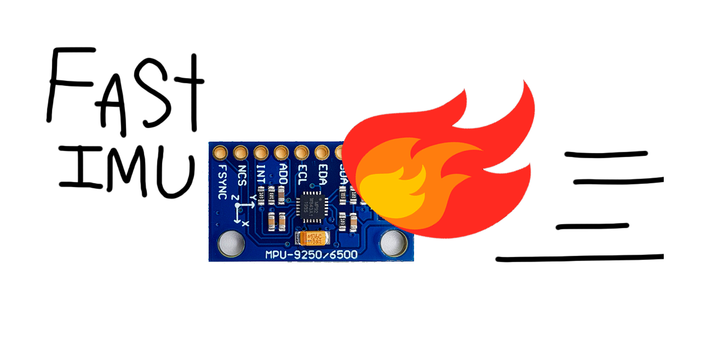

# FastIMU

Currently supported IMUS: 

* MPU9255 
* MPU9250 
* MPU6886 
* MPU6515 
* MPU6500 
* MPU6050
* ICM20689 
* ICM20690 
* BMI055 
* BMX055 (Magnetometer currently untested)
* BMI160
* LSM6DS3 
* LSM6DSL (currently untested)
* QMC5883L

## Data types

* ```AccelData``` Contains all three axis of Accelerometer data, these are named ```accelX```, ```accelY``` and ```accelZ```

* ```GyroData``` Contains all three axis of Gyroscope data, these are named ```gyroX```, ```gyroY``` and ```gyroZ```

* ```MagData``` Contains all three axis of Magnetometer data, these are named ```magX```, ```magY``` and ```magZ```

* ```Quaternion``` Contains Quaternion data, the components are named ```qW```, ```qX```, ```qY``` and ```qZ```

* ```CalData``` Contains a boolean component named ```valid``` that must be set to ```true``` if the data is valid, it contains float array named ```accelBias``` for accelerometer biases, one named ```gyroBias``` for gyroscope bias, one named ```magBias``` for magnetometer biases and one named ```magScale``` for magnetometer scaling.

## Functions
* ```init``` Takes in a ```calData``` function and a ```byte``` address, this function initializes the IMU, it defaults to the maximum ranges allowed by the IMU. This function will return a 0 if initialization was successful and a negative number if it failed to connect to the IMU.

* ```update``` Reads new IMU data if available.

* ```getAccel``` Takes in a pointer to ```AccelData``` and copies new accelerometer data to it, should be called after update.

* ```getGyro``` Takes in a pointer to ```GyroData``` and copies new gyroscope data to it, should be called after update.

* ```getMag``` Takes in a pointer to ```MagData``` and copies new magnetometer data to it, should be called after update. Will only return new magnetometer data if the IMU has a magnetometer.
 
* ```getQuat``` Takes in a pointer to a ```Quaternion``` and copies new quaternion data to it, should be called after update. Will only return new Quaternion data if the IMU has a Quaternion output.

* ```getTemp``` Returns temperature float data in °C, should be called after update, isn't very accurate.

* ```setGyroRange``` Takes in an integer with the dps range wanted, (for example 2000 for ±2000dps), returns 0 if successful, returns -1 if the input range is not valid.

* ```setAccelRange``` Takes in an integer with the dps range wanted, (for example 8 for ±8g), returns 0 if successful, returns -1 if the input range is not valid.

* ```calibrateAccelGyro``` Takes in a pointer to calibration data and runs a Accelerometer and Gyroscope calibration, storing the new accelerometer and gyroscope calibration data in it. the IMU should be kept completely still and level during this.

* ```calibrateMag``` Takes in a pointer to Calibration data and runs a Accelerometer and Gyroscope calibration, storing the new accelerometer and gyroscope calibration data in it. the IMU should be moved in a figure eight pattern while calibrating, calibration takes around 15 seconds.

* ```hasMagnetometer``` Returns true if the IMU has a magnetometer.

* ```hasTemperature``` Returns true if the IMU has a thermometer.

* ```hasQuatOutput``` Returns true if the IMU has a direct quaternion output.

##### TODO: get DMP working for pure quaternion output from invsense IMU's